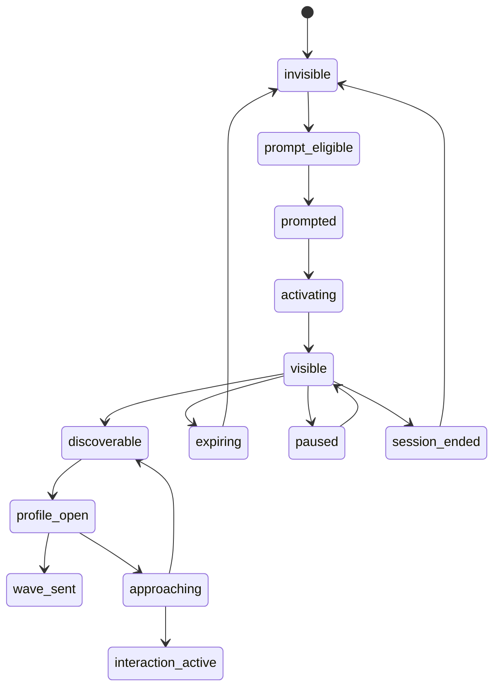

# Left Engineering Build Spec

Status:
- engineering-ready MVP build document

Depends on:
- `docs/left-product-spec.md`
- `docs/left-mvp-wireframes.md`
- `left_design.md`
- `left_design_ui.md`

Primary implementation rule:
- the `Nearby Feed` is the canonical MVP discovery surface
- venue context supports activation decisions
- the bubble layer is optional and reuses the same discovery records

## 1. Build Goal

Ship a mobile MVP that lets a user:
1. receive a visibility prompt after dwell-time detection
2. activate a temporary presence session
3. browse compatible nearby people in the nearby feed
4. inspect a soft-anonymity profile
5. wave or enter the approaching micro-state
6. confirm real-world connection or cancel
7. access safety controls at all active stages

## 2. Suggested Stack

- mobile app: `Expo` + `React Native` + `TypeScript`
- navigation: `Expo Router`
- state: `Zustand`
- backend: `Supabase`
- auth: Supabase auth
- database: Postgres
- realtime: Supabase realtime
- validation: `Zod`
- forms: `React Hook Form`
- analytics: `PostHog`

## 3. Canonical Screen Set

Implement in this order:

1. Presence Activation Sheet
2. Nearby Feed
3. Soft-Anonymity Profile
4. Approaching Micro-State
5. Venue Context / Venue Pulse
6. Safety Controls
7. Bubble Visualization Layer

## 4. Screen Contracts

### 4.1 Presence Activation Sheet

Purpose:
- create or resume a temporary presence session

Inputs:
- `intent`
- `vibes[]`
- `duration_minutes`
- `hint_text`

Display fields:
- venue name
- prompt copy
- intent options
- vibe options
- duration options
- hint card input
- submit CTA

Validation:
- exactly one `intent`
- at least one `vibe`
- duration required
- hint optional, max 80 chars

Primary actions:
- `submit_presence_activation`
- `cancel_activation`

Success result:
- session created
- user transitions to `visible`
- nearby feed loads

Failure states:
- location unavailable
- venue not eligible
- network failure
- validation error

### 4.2 Nearby Feed

Purpose:
- primary MVP discovery surface

Display fields per feed item:
- `profile_id`
- `first_name`
- `avatar_style` or `avatar_url`
- `intent`
- `vibes[]`
- `hint_text`
- `shared_alignment_label`
- `distance_bucket`
- `session_expires_at`

Primary actions:
- `open_profile(profile_id)`
- `wave(profile_id)`
- `hide_user(profile_id)`
- `report_user(profile_id)`
- `block_user(profile_id)`
- `open_safety_controls()`

Rules:
- exact location never shown
- no `save user` action
- no chat entry point
- shared alignment should display one factual line only

Empty states:
- no visible matches but venue active
- venue pulse / low-density state
- user not yet visible

### 4.3 Soft-Anonymity Profile

Purpose:
- increase confidence before approach

Display fields:
- `first_name`
- `alias` if used
- `avatar_url` or stylized identity representation
- `intent`
- `vibes[]`
- `hint_text`
- `shared_alignment_label`
- `icebreaker_prompt`

Primary actions:
- `wave(profile_id)`
- `start_approach(profile_id)`
- `hide_user(profile_id)`
- `report_user(profile_id)`
- `block_user(profile_id)`

Rules:
- first name and hint remain consistently visible
- mutual context is above generic profile content
- no long bio required for MVP

### 4.4 Approaching Micro-State

Purpose:
- bridge digital confidence to physical action

Display fields:
- `target_profile_id`
- `target_first_name`
- `hint_text`
- `icebreaker_prompt`
- `approach_expires_at`
- `seconds_remaining`

Primary actions:
- `confirm_im_going_over`
- `confirm_connected`
- `cancel_approach`
- `open_safety_controls()`

Rules:
- timer starts from server timestamp
- timer expiry closes state
- if expired, user returns to feed or profile with explicit expired message

### 4.5 Venue Context / Venue Pulse

Purpose:
- help user decide if activation is worthwhile

Display fields:
- `venue_name`
- `energy_level`
- `visible_count`
- `active_vibes[]`
- `popular_intents[]`
- `recent_activity_copy`

Primary actions:
- `open_activation_sheet`
- `open_nearby_feed`

Rules:
- show pulse state when live density is low
- never feel like silent failure

### 4.6 Safety Controls

Purpose:
- immediate safety actions

Display fields:
- current visibility status
- current session status
- blocked users summary
- safety zones summary

Primary actions:
- `pause_visibility`
- `end_session`
- `block_user`
- `report_user`
- `add_safety_zone`
- `remove_safety_zone`

### 4.7 Bubble Visualization Layer

Purpose:
- optional ambient layer over nearby feed data

Rules:
- reads from same discovery dataset as nearby feed
- no additional business logic
- tapping a bubble opens the same profile flow

## 5. Presence State Machine

Canonical states:

- `invisible`
- `prompt_eligible`
- `prompted`
- `activating`
- `visible`
- `discoverable`
- `profile_open`
- `wave_sent`
- `approaching`
- `interaction_active`
- `expiring`
- `session_ended`
- `paused`

Core transitions:



Implementation notes:
- `visible` means the local user has an active presence session
- `discoverable` means feed data is loaded and interaction is possible
- `interaction_active` means an approach has been confirmed or connection acknowledged

## 6. Identity Reveal Rules

MVP rule set:

- always visible in feed:
  - `first_name`
  - `intent`
  - one or more `vibes`
  - `hint_text`
  - one shared alignment line when applicable
- profile open:
  - avatar becomes more prominent
  - icebreaker becomes visible
  - extra context may be revealed if already in mockup
- never visible:
  - exact coordinates
  - persistent history
  - deep social graph

## 7. Data Model

### 7.1 users

Fields:
- `id uuid pk`
- `first_name text not null`
- `alias text null`
- `avatar_url text null`
- `default_intent text null`
- `default_vibes text[] not null default '{}'`
- `focus_mode_enabled boolean not null default false`
- `prompts_enabled boolean not null default true`
- `created_at timestamptz not null default now()`

### 7.2 venues

Fields:
- `id uuid pk`
- `name text not null`
- `type text not null`
- `city text null`
- `geofence_json jsonb not null`
- `is_active boolean not null default true`
- `created_at timestamptz not null default now()`

### 7.3 presence_sessions

Fields:
- `id uuid pk`
- `user_id uuid not null`
- `venue_id uuid not null`
- `intent text not null`
- `vibes text[] not null`
- `hint_text text null`
- `status text not null`
- `prompt_state text not null`
- `started_at timestamptz not null`
- `expires_at timestamptz not null`
- `paused_at timestamptz null`
- `ended_at timestamptz null`
- `created_at timestamptz not null default now()`

Constraints:
- one active presence session per user
- `expires_at > started_at`

### 7.4 prompt_events

Fields:
- `id uuid pk`
- `user_id uuid not null`
- `venue_id uuid not null`
- `triggered_at timestamptz not null`
- `reason text not null`
- `accepted boolean null`

Purpose:
- prevent over-prompting
- support max one prompt per venue per day

### 7.5 waves

Fields:
- `id uuid pk`
- `from_user_id uuid not null`
- `to_user_id uuid not null`
- `presence_session_id uuid not null`
- `status text not null`
- `created_at timestamptz not null default now()`

Statuses:
- `sent`
- `seen`
- `reciprocated`
- `expired`
- `cancelled`

### 7.6 approach_attempts

Fields:
- `id uuid pk`
- `from_user_id uuid not null`
- `to_user_id uuid not null`
- `presence_session_id uuid not null`
- `status text not null`
- `started_at timestamptz not null`
- `expires_at timestamptz not null`
- `completed_at timestamptz null`
- `cancelled_at timestamptz null`

Statuses:
- `started`
- `confirmed_going`
- `connected`
- `expired`
- `cancelled`

### 7.7 hidden_users

Fields:
- `id uuid pk`
- `actor_user_id uuid not null`
- `target_user_id uuid not null`
- `created_at timestamptz not null default now()`

### 7.8 blocks

Fields:
- `id uuid pk`
- `actor_user_id uuid not null`
- `target_user_id uuid not null`
- `reason text null`
- `created_at timestamptz not null default now()`

### 7.9 reports

Fields:
- `id uuid pk`
- `actor_user_id uuid not null`
- `target_user_id uuid not null`
- `presence_session_id uuid null`
- `category text not null`
- `notes text null`
- `created_at timestamptz not null default now()`

### 7.10 safety_zones

Fields:
- `id uuid pk`
- `user_id uuid not null`
- `name text not null`
- `geofence_json jsonb not null`
- `behavior text not null`
- `created_at timestamptz not null default now()`

Behaviors:
- `suppress_prompts`
- `suppress_visibility`
- `warn_only`

## 8. Derived Read Models

### 8.1 nearby_feed_items

Purpose:
- single query/view for the canonical discovery surface

Fields:
- `profile_user_id`
- `presence_session_id`
- `first_name`
- `alias`
- `avatar_url`
- `intent`
- `vibes`
- `hint_text`
- `shared_alignment_label`
- `distance_bucket`
- `venue_name`
- `energy_level`
- `session_expires_at`

Business logic:
- exclude blocked users
- exclude hidden users
- exclude expired sessions
- exclude self
- rank by venue, intent compatibility, shared vibe overlap, recency

### 8.2 venue_context_summary

Fields:
- `venue_id`
- `venue_name`
- `visible_count`
- `energy_level`
- `active_vibes`
- `popular_intents`
- `pulse_copy`

## 9. API / Backend Actions

These can be implemented as Supabase RPC, edge functions, or server handlers.

### 9.1 `activate_presence`

Input:
```json
{
  "venue_id": "uuid",
  "intent": "networking",
  "vibes": ["ai_startups"],
  "duration_minutes": 60,
  "hint_text": "Blue headphones"
}
```

Output:
```json
{
  "presence_session_id": "uuid",
  "status": "visible",
  "expires_at": "timestamp"
}
```

### 9.2 `end_presence`

Input:
- `presence_session_id`

Output:
- success boolean

### 9.3 `pause_presence`

Input:
- `presence_session_id`

Output:
- updated session status

### 9.4 `get_nearby_feed`

Input:
- `venue_id`

Output:
- list of `nearby_feed_items`

### 9.5 `get_profile_context`

Input:
- `target_user_id`
- `presence_session_id`

Output:
- profile payload with shared alignment and icebreaker

### 9.6 `send_wave`

Input:
- `target_user_id`
- `presence_session_id`

Output:
- wave status

### 9.7 `start_approach`

Input:
- `target_user_id`
- `presence_session_id`

Output:
```json
{
  "approach_attempt_id": "uuid",
  "started_at": "timestamp",
  "expires_at": "timestamp",
  "status": "started"
}
```

### 9.8 `confirm_connected`

Input:
- `approach_attempt_id`

Output:
- updated approach status

### 9.9 `hide_user`

Input:
- `target_user_id`

Output:
- success boolean

### 9.10 `block_user`

Input:
- `target_user_id`
- `reason`

Output:
- success boolean

### 9.11 `report_user`

Input:
- `target_user_id`
- `presence_session_id`
- `category`
- `notes`

Output:
- report id

## 10. Client Events

Track at minimum:

- `prompt_received`
- `prompt_opened`
- `presence_activated`
- `presence_cancelled`
- `nearby_feed_loaded`
- `profile_opened`
- `wave_sent`
- `approach_started`
- `approach_cancelled`
- `approach_connected`
- `session_expiring_seen`
- `session_ended`
- `safety_opened`
- `user_hidden`
- `user_blocked`
- `user_reported`
- `venue_pulse_seen`

## 11. Ranking Logic

MVP ranking order:

1. same venue only
2. active sessions only
3. compatible intent first
4. highest vibe overlap first
5. most recent active sessions first
6. shorter distance bucket first

Distance buckets:
- `same_area`
- `nearby`
- `within_venue`

Do not expose exact meters in MVP.

## 12. Prompt Eligibility Rules

User becomes `prompt_eligible` when:
- device is inside eligible venue geofence
- dwell time >= threshold
- user has not been prompted at same venue today
- prompts are enabled
- focus mode is off

User becomes `prompted` when:
- prompt is actually delivered

Thresholds to keep configurable:
- dwell time minutes
- max prompts per venue per day
- minimum density threshold

## 13. Error and Edge Cases

### No density
- show venue pulse
- do not show blank feed without explanation

### Session expiry while browsing
- show expiring banner
- remove user from feed when session ends

### Target session expires before approach
- approaching state closes
- show `This person is no longer visible nearby`

### Duplicate active session
- backend should close or reject prior active session before creating a new one

### Block or report during active approach
- immediately end local interaction state
- remove target from feed

## 14. Implementation Phases

### Phase 1
- auth
- venue detection stub
- presence activation UI
- local mocked nearby feed
- profile modal
- approaching UI

### Phase 2
- Supabase schema
- realtime presence sessions
- feed ranking query
- waves
- hide/block/report
- venue pulse

### Phase 3
- dwell-time prompt logic
- expiring session banners
- safety zones
- bubble visualization layer

## 15. Definition of Done

The MVP build is done when:
- a signed-in user can activate visibility
- an active presence session appears in the nearby feed
- another visible user can be opened as a profile
- wave and approach flows work end-to-end
- approach timer expires correctly from server time
- session expiry removes users from discovery
- hide, block, report, and end-session flows work
- venue pulse covers low-density cases
- no chat or save-user paths remain in the shipped MVP
