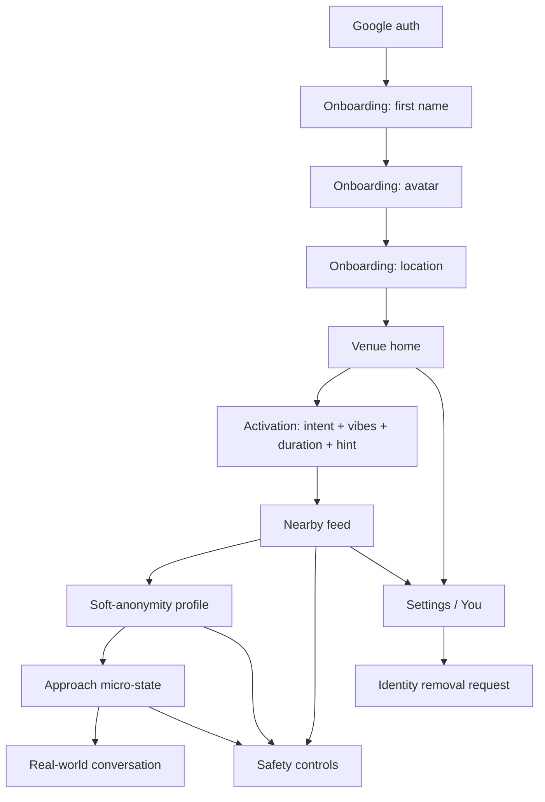

# Left MVP Wireframes

Status:
- historical wireframe reference
- useful for early flow and hierarchy context
- not the canonical implementation contract anymore

Read this with:
- [left-engineering-build-spec.md](/Users/kelvinaliche/Desktop/Projects/leftApp/docs/left-engineering-build-spec.md) for current app behavior
- [location-venue-logic.md](/Users/kelvinaliche/Desktop/Projects/leftApp/docs/location-venue-logic.md) for the live venue pipeline
- [venues-google.md](/Users/kelvinaliche/Desktop/Projects/leftApp/docs/venues-google.md) for Google Places usage and cost strategy

Source inputs:
- `contextual_social_app_v2_spec.pdf`
- `contextual_social_app_design_review.pdf`
- `left designs ui/left_social_discovery_flow_refined/code.html`
- `left designs ui/home_discovery_map/code.html`
- `left designs ui/activation_set_vibe/code.html`
- `left designs/soft_anonymity_profile/code.html`
- `left designs ui/approaching_timer/code.html`
- `left designs/safety_controls/code.html`
- `left designs/spatial_presence_feed/code.html`
- `left designs/connection_moment/code.html`

Purpose:
- translate the visual mockups into low-fidelity product wireframes
- preserve the MVP flow without locking implementation to current styling
- make screen structure, hierarchy, and actions explicit for engineering
- reflect the current implemented mobile flow, not only the original concept flow

## Core Flow


```mermaid
flowchart TD
  A["Google auth"] --> B["Onboarding: first name"]
  B --> C["Onboarding: avatar"]
  C --> D["Onboarding: location"]
  D --> E["Venue home"]
  E --> F["Activation: intent + vibes + duration + hint"]
  F --> G["Nearby feed"]
  G --> H["Soft-anonymity profile"]
  H --> I["Approach micro-state"]
  I --> J["Real-world conversation"]
  G --> K["Safety controls"]
  H --> K
  I --> K
  E --> L["Settings / You"]
  G --> L
  L --> M["Identity removal request"]
```

## Current App Shell

The implemented app currently uses this top-level screen set:

- loading
- auth
- onboarding name
- onboarding avatar
- onboarding location
- venue
- activate
- feed
- profile
- approach
- safety
- settings

The current bottom navigation is persistent across in-session screens and uses four destinations:

- `Home`
- `Nearby`
- `Session`
- `You`

## Canonical MVP Discovery Surface

The canonical MVP discovery surface is the `Nearby Feed`.

Interpretation:
- the nearby feed is the primary interactive surface for discovery and decision-making
- venue context supports the decision to activate or browse
- the bubble/spatial layer is a secondary visualization of the same data, not a separate MVP flow

Engineering implication:
- build one discovery data model and one primary click path
- do not split the MVP into competing map-first and feed-first experiences

## Current Screen Priority

The current product flow makes these screens highest priority:

1. Google auth and onboarding
2. Venue home + footer navigation
3. Presence activation
4. Nearby feed
5. Soft-anonymity profile
6. Approaching micro-state
7. Settings / identity removal

The venue context, safety surfaces, and account flows support this core loop.

## UI Design Principles

These principles govern the Home screen and every future screen. They are product rules, not decorative preferences.

### 1. One Hero Per Screen

Every screen must have exactly one dominant element.

Examples:
- Home: Presence card
- Venue: People currently here
- Profile: User identity

Rule:
- supporting modules must never compete with the hero for attention
- if two elements feel equally loud, the screen is wrong

### 2. Progressive Information

Users should not have to think about what to read next.

Information should appear in this order:

1. where am I?
2. what is my status?
3. what can I do?
4. where should I go?
5. who is there?
6. take action

Every screen should follow this flow as closely as possible.

### 3. Build Trust Before Action

Before asking the user to press anything, reassure them that the app understands their context.

Examples:
- `You're near Tad's Steakhouse`
- `Updated just now`
- `Private by default`

The interface must answer these questions before presenting the primary CTA:
- can people already see me?
- is my GPS wrong?
- is this live?

### 4. The App Should Feel Human

Avoid robotic product copy.

Prefer:
- `You're near Tad's Steakhouse`
- `You're hidden right now`

Avoid:
- `Nearby Venue Detected`
- `Presence Disabled`

Rule:
- write copy the way a calm person would explain the situation to another person in real life

### 5. The Interface Breathes

Every component should have room around it.

Requirements:
- large outer margins
- soft internal spacing
- no crowded stacks
- no dense multi-card compression that makes the screen feel stressful

The product should feel calm, not busy.

### 6. Primary Action Wins

Each screen should have one obvious action.

Examples:
- Home: `Go visible`
- Venue: `Wave`
- Profile: `Edit profile`

Rule:
- secondary controls should support the primary action, not compete with it

### 7. Information Hierarchy

Use typography consistently so users understand importance before they read details.

Recommended type scale:
- Hero message: `32-40px`
- Section title: `22-26px`
- Card title: `18-20px`
- Body: `16px`
- Metadata: `13-14px`

Rule:
- the user should know what matters first without reading every line

### Immediate Home Screen Implications

For the current Home screen, these principles mean:
- the merged presence card remains the hero and should stay visually dominant
- location context must stay strong and appear before the presence CTA
- nearby places cards should support the hero rather than compete with it
- the safety row should remain quieter than the presence card and nearby places
- any future additions, including weather-aware greetings, must remain secondary to presence and visibility

## Screen 0: Auth

Goal:
- get the user into the product through native Google OAuth
- bootstrap an existing profile or route a new user into onboarding

Primary actions:
- continue with Google
- inspect the clearly deferred email option

Low-fi wireframe:

```text
+--------------------------------------------------+
|                 LEFT mark                        |
|                                                  |
|          WELCOME TO LEFT                         |
|        People. Places. Presence.                 |
|   Connection starts with being there.            |
|                                                  |
| [ Continue with Google ]                         |
| ----------------- or -----------------           |
| Continue with email — COMING SOON                |
|                                                  |
| auth error state if needed                       |
| lock  Your presence. Your choice.                |
+--------------------------------------------------+
```

Rules:
- Google is the primary working auth provider today
- auth returns into the native app via `left://auth/callback`
- no local email/password flow in the current app
- the email row opens a coming-soon explanation and must not imply that email auth is available
- the welcome screen shares the onboarding Creole Brown and Yellow Green palette

## Screen 0.1: Onboarding

Goal:
- collect the minimum data needed to create a usable profile

Primary actions:
- set first name
- choose avatar style
- allow location
- finish onboarding
- continue from the completion reveal

Low-fi wireframe:

```text
+--------------------------------------------------+
| Step 1: first name                               |
| [ Kelvin____________________ ]                   |
| [ Continue ]                                     |
+--------------------------------------------------+
| Step 2: avatar style                             |
| [Soft Square] [Echo] [Orbit] [Pebble]            |
| [ Surprise me ]                                  |
| nearby-profile preview                           |
| [ Continue ]                                     |
+--------------------------------------------------+
| Step 3: venue detection                          |
| enter place -> detect venue -> nearby people     |
| exact location is not shown to other people      |
| [ Turn on venue detection ]                      |
+--------------------------------------------------+
| Completion                                       |
| social shape + first name                        |
| "Your signal is ready."                         |
| [ See what's nearby ]                            |
+--------------------------------------------------+
```

Rules:
- onboarding is three required steps followed by a completion reveal
- Creole Brown `#1F0E06` and Yellow Green `#C6E385` own the onboarding palette
- finishing venue detection persists the `public.users` profile row before the completion reveal
- the completion action routes to Home without writing the profile a second time

## Screen 1: Venue Home

Goal:
- provide the current venue pulse and the main entry into discovery
- show the active footer summary state for venue, vibe, and intent

Primary actions:
- open activation flow
- open nearby feed when already visible
- switch via footer to nearby, session, or settings

Low-fi wireframe:

```text
+--------------------------------------------------+
| Venue home                                       |
+--------------------------------------------------+
| Venue name                     Energy badge      |
| Pulse copy / visible count                       |
| Active vibes recently                            |
|                                                  |
| [ Become visible ] or [ Open nearby ]            |
+--------------------------------------------------+
| Footer: Home | Nearby | Session | You            |
+--------------------------------------------------+
```

Rules:
- this is the main home state after auth/onboarding
- footer stays persistent across in-session screens

## Screen 2: Presence Activation Sheet

Goal:
- convert a user into an intentionally visible participant with minimal friction
- preserve opt-in presence and temporary visibility

Primary actions:
- choose intent
- choose vibe(s)
- choose active duration
- add a visual identification hint
- become visible

Low-fi wireframe:

```text
+--------------------------------------------------+
| Set your presence                                |
+--------------------------------------------------+
| Intent                                           |
| [Networking] [Open to chat] [Group discussion]   |
|                                                  |
| Vibes                                            |
| [AI/startups] [Design] [Travel] [Creativity]     |
|                                                  |
| Duration                                         |
| [30m] [60m] [120m]                               |
|                                                  |
| Hint card                                        |
| "Grey hoodie, corner seat"                       |
|                                                  |
| [ Become visible ]                               |
+--------------------------------------------------+
| Footer: Home | Nearby | Session | You            |
+--------------------------------------------------+
```

Rules:
- one primary intent at a time
- up to two vibes in the current implementation
- duration must expire automatically
- hint is optional but strongly encouraged
- defaults preload from saved profile state where applicable

## Screen 3: Nearby Feed Card

Goal:
- show enough contextual information to decide whether to approach without oversharing
- support a fast decision in the core loop

Primary actions:
- open a nearby profile
- wave
- hide or dismiss a user
- open safety controls

Low-fi wireframe:

```text
+--------------------------------------------------+
| Venue name                     Energy badge      |
| N visible now                                    |
+--------------------------------------------------+
| Kelvin                                           |
| [Networking] [AI/startups]                       |
| Hint: Blue headphones                            |
| You both selected AI/startups                    |
|                                                  |
| [ Wave ] [ View profile ] [ Hide ]               |
+--------------------------------------------------+
| [ Safety ]                                       |
+--------------------------------------------------+
| Footer: Home | Nearby | Session | You            |
+--------------------------------------------------+
```

Rules:
- first name, vibe, intent, and hint are enough for feed-level decisioning
- shared alignment signal should be factual, low-pressure, and singular
- exact coordinates are not shown
- no persistent “save user” action in MVP

## Screen 4: Soft-Anonymity Profile

Goal:
- provide enough signal to decide whether to engage
- preserve privacy until mutual intent is stronger

Primary actions:
- wave
- commit to approach
- open safety controls

Low-fi wireframe:

```text
+--------------------------------------------------+
| Ambient header / blurred discovery context       |
+--------------------------------------------------+
| Avatar   Display name / alias                    |
|          [Intent] [Shared vibe]                  |
|                                                  |
| Hint                                             |
| Look for: Blue headphones                        |
|                                                  |
| Shared context                                   |
| You both selected AI/startups                    |
|                                                  |
| Icebreaker                                       |
| customizable nearby prompt                       |
|                                                  |
| [ Wave ]     [ I'm going over ]                  |
+--------------------------------------------------+
| [ Safety ]                                       |
+--------------------------------------------------+
| Footer: Home | Nearby | Session | You            |
+--------------------------------------------------+
```

Rules:
- profile is contextual, not identity-heavy
- first name and hint card are always visible
- avatar and vibe become more prominent after opening the profile
- intent should be surfaced when it matches the viewer's context
- mutual context should be surfaced above generic bio content
- icebreaker prompt is user-customizable from settings
- no chat entry point in MVP

## Screen 5: Approaching Micro-State

Goal:
- support an in-person connection attempt with clear temporal pressure
- reduce ambiguity during approach

Primary actions:
- confirm connection happened
- cancel approach
- escalate to safety if needed

Low-fi wireframe:

```text
+--------------------------------------------------+
| I'm going over                                   |
+--------------------------------------------------+
| Kelvin                                           |
+--------------------------------------------------+
|                                                  |
|                circular countdown                |
|                      60 sec                      |
|                                                  |
|  Look for                                        |
|  Blue headphones                                 |
|                                                  |
|  Icebreaker prompt                               |
|  customizable approach prompt                    |
|                                                  |
|  [ We connected! ]                               |
|  [ Cancel ]                                      |
+--------------------------------------------------+
| [ Safety ]                                       |
+--------------------------------------------------+
| Footer: Home | Nearby | Session | You            |
+--------------------------------------------------+
```

Rules:
- countdown colors shift from normal to warning to urgent
- timer should expire automatically
- post-expiry state must close the encounter or require explicit reset
- this is the explicit handoff from digital confidence to physical action
- approach prompt is user-customizable from settings

## Screen 6: Venue Pulse / Empty State

Goal:
- prevent low-density venues from feeling broken or abandoned
- explain why no one is visible yet

Primary actions:
- understand venue activity
- decide whether to activate

Low-fi wireframe:

```text
+--------------------------------------------------+
| Venue pulse                                      |
+--------------------------------------------------+
| This spot is quiet right now                     |
|                                                  |
| 3 people have been active here this week         |
| or                                               |
| Be the first to open up here                     |
|                                                  |
| Active vibes recently                            |
| [AI/startups] [Creativity]                       |
|                                                  |
| [ Become visible ]                               |
+--------------------------------------------------+
```

Rules:
- empty state must explain low-density conditions
- venue pulse should invite action rather than imply failure

## Screen 7: Safety Controls

Goal:
- give the user a visible escape hatch at all stages
- make safety features proactive, not buried in settings

Primary actions:
- pause visibility
- end current session
- block/report
- manage safety zones

Low-fi wireframe:

```text
+--------------------------------------------------+
| Safety Settings                                  |
+--------------------------------------------------+
| Visibility status                                |
| [ Pause visibility ] [ End current session ]     |
|                                                  |
| Session actions                                  |
| [ Block person ] [ Report interaction ]          |
|                                                  |
| Safety zones                                     |
| [ Home ] [ Work ] [ Add new safety zone ]        |
|                                                  |
| Safety scan / system state                       |
| "Safety scan complete"                           |
+--------------------------------------------------+
```

Rules:
- safety entry point remains persistent across discovery and encounter flows
- hiding or ending a session should be fast and reversible where safe
- blocking/reporting should require minimal effort

## Screen 8: Profile And Settings

Goal:
- give the signed-in user separate destinations for profile editing and account actions

Primary actions:
- edit first name
- edit avatar style
- edit default intent
- edit default vibes
- open safety controls
- log out
- request identity removal

Low-fi wireframe:

```text
+--------------------------------------------------+
| Your profile                                     |
| avatar + signed-in state                         |
+--------------------------------------------------+
| First name                                       |
| [ Kelvin____________________ ]                   |
|                                                  |
| Avatar style                                     |
| [geometric] [abstract] [minimal] [soft]          |
|                                                  |
| Default intent / vibes                           |
| [Networking] [AI/startups] [Design]              |
|                                                  |
| [ Save profile defaults ]                        |
+--------------------------------------------------+
| Settings                                         |
| Account                                          |
| [ Privacy and safety                         > ]  |
| [ Notifications                              > ]  |
| General                                          |
| [ About Left                                  > ] |
|                                                  |
| Session                                          |
| Sign out on this device; sign in again anytime.  |
| [ Log out ]                                      |
|                                                  |
| / Identity removal ----------------------------\ |
| | Removes direct identity details. Retained    | |
| | safety/operational records remain.           | |
| | [ Request identity removal ]                 | |
| \----------------------------------------------/ |
+--------------------------------------------------+
| Footer: Home | Nearby | Session | You            |
+--------------------------------------------------+
```

Rules:
- profile defaults are edited on Profile; account actions live on Settings
- logout is neutral and visually separate from identity removal
- identity removal is isolated in a danger card and requires confirmation
- identity removal is not full deletion; it follows the retained-record policy

## Screen 9: Bubble Visualization Layer

Goal:
- reinforce the ambient visual identity of the product
- provide an optional alternate view over the same nearby feed data

Primary actions:
- glance at nearby activity
- tap into the same underlying profile records
- access safety

Low-fi wireframe:

```text
+--------------------------------------------------+
| Venue / context header                           |
+--------------------------------------------------+
|                                                  |
|      o         O highlighted match               |
|   o      O user bubble                           |
|         o      o                                 |
|                                                  |
|  Tap bubble -> opens same profile as feed        |
+--------------------------------------------------+
| Safety FAB                                       |
+--------------------------------------------------+
```

Rules:
- this view must reuse the same source records as the nearby feed
- no discovery-only fields should exist here
- if engineering bandwidth is limited, this layer can ship after the nearby feed

## Screen 10: Connection Moment

Goal:
- represent the strongest mutual-interest state before or during in-person contact

Primary actions:
- confirm presence
- continue interaction
- access safety

Low-fi wireframe:

```text
+--------------------------------------------------+
| Connection moment                                |
+--------------------------------------------------+
| two overlapping orbs / mirrored presence         |
| anonymous but warm visual treatment              |
|                                                  |
| shared moment copy                               |
| contextual prompt                                |
|                                                  |
| [ Continue ]                                     |
+--------------------------------------------------+
| Safety FAB                                       |
+--------------------------------------------------+
```

## MVP Navigation Model

- default entry: Google auth or saved session bootstrap
- new user entry: onboarding name -> avatar -> location
- signed-in default entry: venue home
- primary conversion action: activation sheet
- nearby feed is the primary discovery surface
- profile opens from feed
- bubble visualization, if present, opens the same profile objects as the feed
- approaching micro-state is a focused full-screen mode
- safety is reachable from feed, profile, approach, and settings
- bottom footer navigation is persistent across in-session screens
- settings / `You` is the account and customization destination

## Identity Removal Flow

The current account-removal flow in the app is:

1. user opens `Profile`, then `Settings`
2. user reviews the separate `Session` and `Identity removal` sections
3. user taps `Request identity removal`
4. app confirms the consequences and retained-record policy
5. app creates `public.identity_removal_requests`
6. app calls the backend processor while showing a busy state
7. backend redacts direct identity fields and marks `public.users.identity_removed = true` if processing succeeds
8. app shows recorded/queued feedback and signs the user out when the completion flow requires it
9. future app bootstrap must force local sign-out if a cached session still exists for a profile marked `identity_removed = true`
10. selected product records are retained under policy

This flow is documented in more detail in [identity-removal-policy.md](/Users/kelvinaliche/Desktop/Projects/leftApp/docs/identity-removal-policy.md).

## Open Gaps Before Build

- whether retained profile preference fields should also be reset during identity removal
- the exact progressive reveal rule for name, avatar, intent, and vibe
- whether discovery is strictly venue-based or broader area-based
- whether wave requires reciprocal acceptance before approach
- what happens when approach timer expires without confirmation
- how safety zones affect visibility and matching

## Future Upgrades

- add weather-aware greeting copy on home so the intro can reflect local conditions and time of day, for example `What a sunny afternoon to be out, Kelvin.`
- keep weather greeting as supporting atmosphere rather than the primary headline
- require graceful fallback to the standard greeting when weather data is unavailable or low confidence
